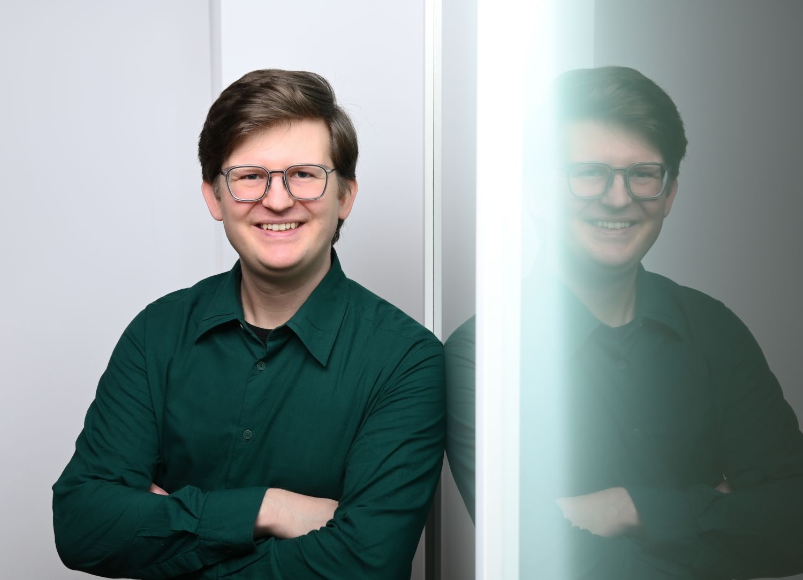

---
# Feel free to add content and custom Front Matter to this file.
# To modify the layout, see https://jekyllrb.com/docs/themes/#overriding-theme-defaults

layout: default
---

Foto: M. Nguyen

## Experience
### 2016-2024 Research associate, Technische Universität Berlin

## Training

* 2024 Doktor der Naturwissenschaften (Dr. rer. nat.), Technische Universität Berlin
* 2016 Master of Science, Technische Universität Berlin
* 2014 Bachelor of Science, Technische Universität Berlin

## Languages

* English (C2)
* German (language of socialization)

## Coding experience

* Julia (9 years)
* Python (4 years)
* C, PHP, Java (2 years)

## Publications

* J. Grawitter, [Fluid flow controlled by light-switchable surface tension and wettability](https://doi.org/10.14279/depositonce-22137) (Doctoral dissertation, 2024, Technische Universität Berlin)
* J. Grawitter and H. Stark, [Steering droplets on substrates with plane-wave wettability patterns and deformations](https://doi.org/10.1039/D4SM00213J), Soft Matter 20, 3161 (2024)
* J. Grawitter and H. Stark, [Droplets on substrates with oscillating wettability](https://doi.org/10.1039/D1SM01113H), Soft Matter 17, 9469 (2021)
* J. Grawitter and H. Stark, [Steering droplets on substrates using moving steps in wettability](https://doi.org/10.1039/D0SM02082F), Soft Matter 17, 2454 (2021)
* J. Grawitter R. van Buel, C. Schaaf, and H. Stark, [Dissipative systems with nonlocal delayed feedback control](https://doi.org/10.1088/1367-2630/aae998), New Journal of Physics 20, 113010 (2018)
* J. Grawitter and H. Stark, [Feedback control of photoresponsive fluid interfaces](https://doi.org/10.1039/C7SM02101A), Soft Matter 14, 1856 (2018)

